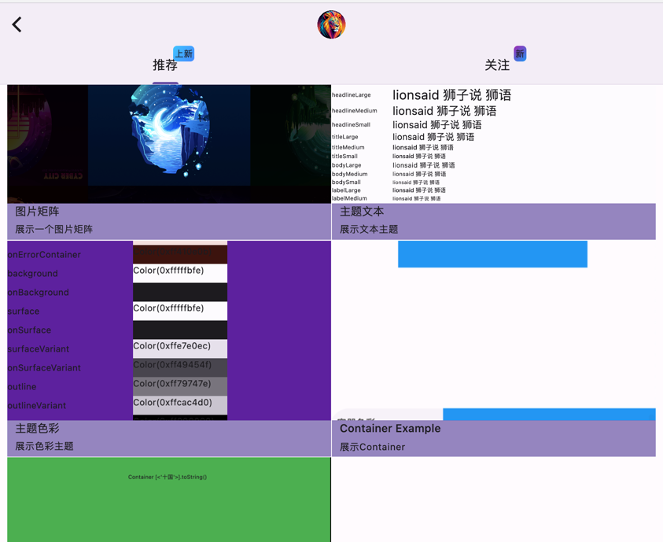
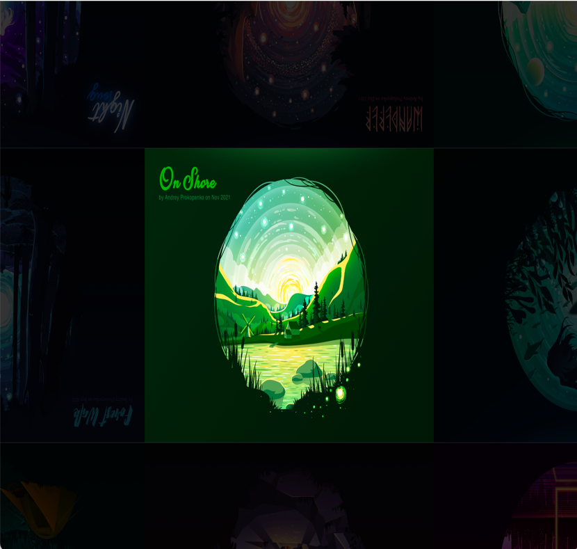
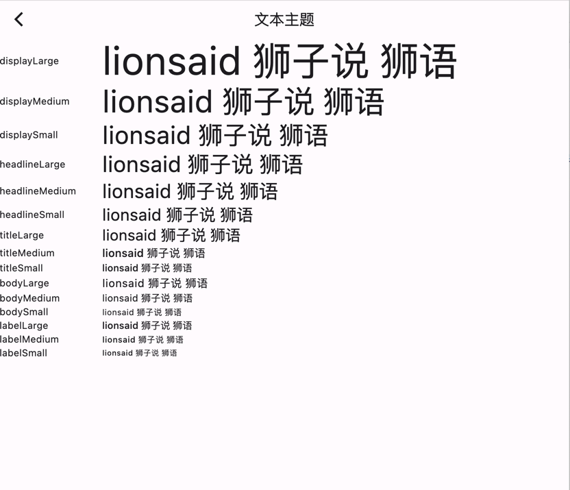
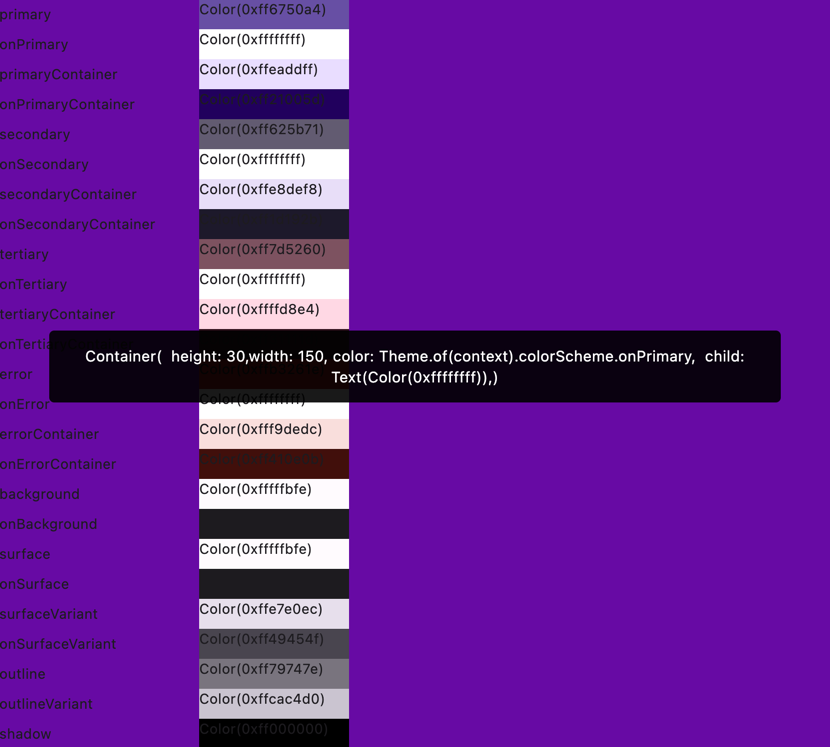
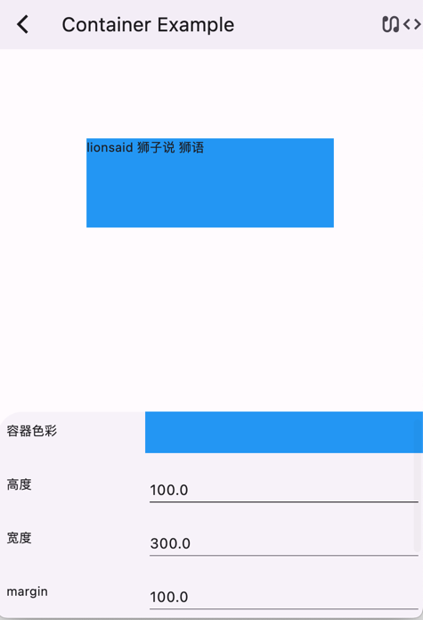
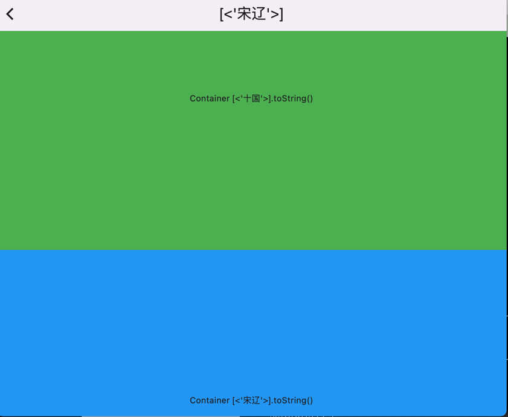
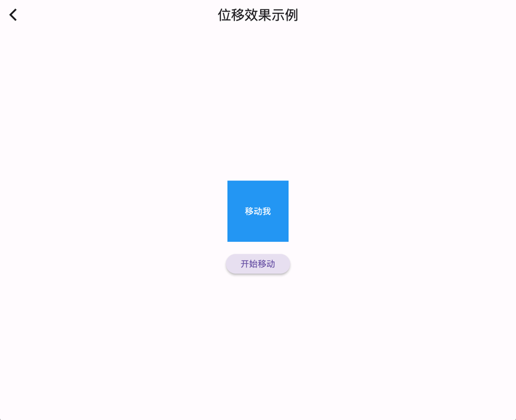

# 狮子说 flutter 示例
```html
[color_theme_screen.dart] 色彩主题列表
[container_example_screen.dart] container 属性的示例
[matrix_images_screen.dart] 图片矩阵，随点击改变位置
[text_theme_screen.dart] 字体主题列表
[splash_screen.dart] 定时开屏页面
[home_screen.dart] 主页包含路由信息
[scroll_listener_screen.dart] 监控容器在当前屏幕的显示比例，当比例大于0.35时修改title的名称


```










